# 🎵 BeatAtlas

Uma aplicação web moderna para explorar e gerenciar sua música no Spotify. Descubra seus artistas favoritos, faça buscas avançadas, visualize estatísticas e gerencie sua biblioteca musical de forma intuitiva.

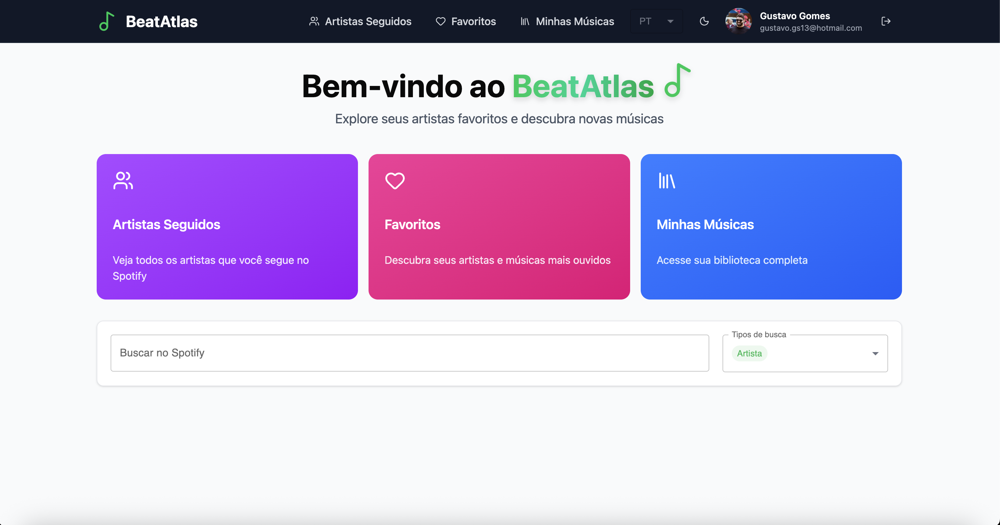

## ✨ Funcionalidades

### 🔐 Autenticação
- Login seguro via OAuth 2.0 com Spotify
- Gerenciamento de sessão e tokens
- Proteção de rotas autenticadas
- 📖 [Documentação completa do OAuth 2.0](OAUTH_EXPLAINED.md)

### 🏠 Página Inicial
- Interface de boas-vindas personalizada
- Navegação rápida para principais seções
- Busca avançada de artistas, músicas e álbuns
- Resultados paginados com navegação independente por tipo

### 👥 Artistas Seguidos
- Visualize todos os artistas que você segue no Spotify
- Paginação com cursor para grandes listas
- Cards informativos com imagens e seguidores
- Acesso rápido aos detalhes de cada artista

### ⭐ Favoritos
- Visualize seus artistas e músicas mais ouvidos
- Filtros por período (4 semanas, 6 meses, todos os tempos)
- Gráfico de pizza interativo mostrando artistas mais ouvidos
- Listagem detalhada de top tracks

### 🎤 Detalhes do Artista
- Informações completas do artista
- Galeria de álbuns com paginação
- Visualização de top tracks do artista
- Design responsivo e moderno

### 🎵 Minhas Músicas
- Gerencie sua biblioteca pessoal de músicas favoritas
- Formulário com autocomplete inteligente (busca no Spotify)
- Validação de formulários com Zod
- Persistência local por usuário
- Sistema de favoritar/desfavoritar com ícone de coração

### 🎨 Interface
- Design moderno com Tailwind CSS
- Suporte a tema claro e escuro
- Responsivo
- Internacionalização (Português e Inglês)

## 🛠️ Tecnologias

- **React 19** - Biblioteca UI
- **TypeScript** - Tipagem estática
- **Vite** - Build tool e dev server
- **React Router** - Roteamento
- **React Query (TanStack Query)** - Gerenciamento de estado e cache
- **Tailwind CSS** - Estilização utility-first
- **React Hook Form** - Gerenciamento de formulários
- **Zod** - Validação de schemas
- **Chart.js** - Gráficos e visualizações
- **i18next** - Internacionalização
- **next-themes** - Gerenciamento de temas
- **Lucide React** - Ícones
- **Axios** - Cliente HTTP

## 📋 Pré-requisitos

Antes de começar, você precisará ter instalado:

- **Node.js** (versão 18 ou superior)
- **Yarn** ou **npm**
- **Conta no Spotify** (para desenvolvimento, você precisará criar uma aplicação no [Spotify Developer Dashboard](https://developer.spotify.com/dashboard))

## 🚀 Instalação

1. **Clone o repositório**
   ```bash
   git clone https://github.com/gomesgustavo93/beat-atlas.git
   cd beat-atlas
   ```

2. **Instale as dependências**
   ```bash
   yarn install
   # ou
   npm install
   ```

3. **Configure as variáveis de ambiente**
   
   Copie o arquivo de exemplo e configure suas credenciais:
   ```bash
   cp .env.example .env
   ```
   
   Edite o arquivo `.env` e adicione seu Client ID do Spotify:
   ```env
   VITE_CLIENT_ID=seu_client_id_aqui
   ```
   
   > **Nota:** 
   > - Você precisará criar uma aplicação no [Spotify Developer Dashboard](https://developer.spotify.com/dashboard) para obter o `CLIENT_ID`
   > - Adicione `http://127.0.0.1:5173/callback` como Redirect URI nas configurações da sua aplicação (o Spotify não aceita `localhost`, por isso usamos `127.0.0.1`)
   > - A variável `VITE_REDIRECT_URI` é opcional - se não for definida, será usada automaticamente `http://127.0.0.1:5173/callback` em desenvolvimento

4. **Inicie o servidor de desenvolvimento**
   ```bash
   yarn dev
   # ou
   npm run dev
   ```

5. **Acesse a aplicação**
   
   Abra seu navegador em `http://localhost:5173`

## 📸 Screenshots

### Página de Login
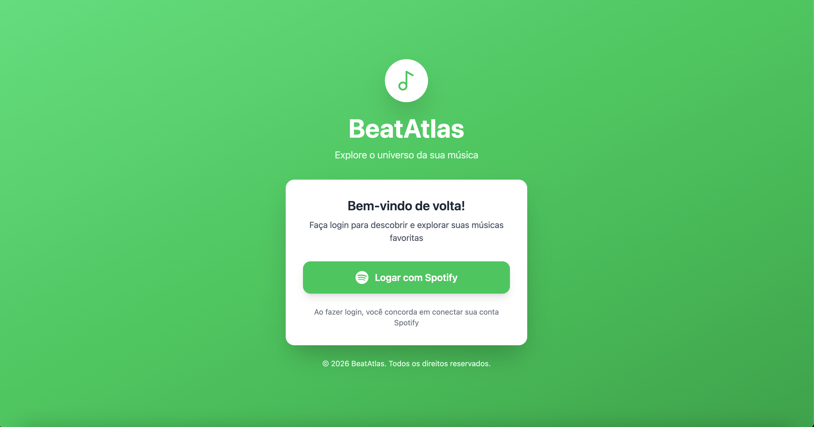

### Página Inicial

**Tema Claro:**


**Tema Escuro:**
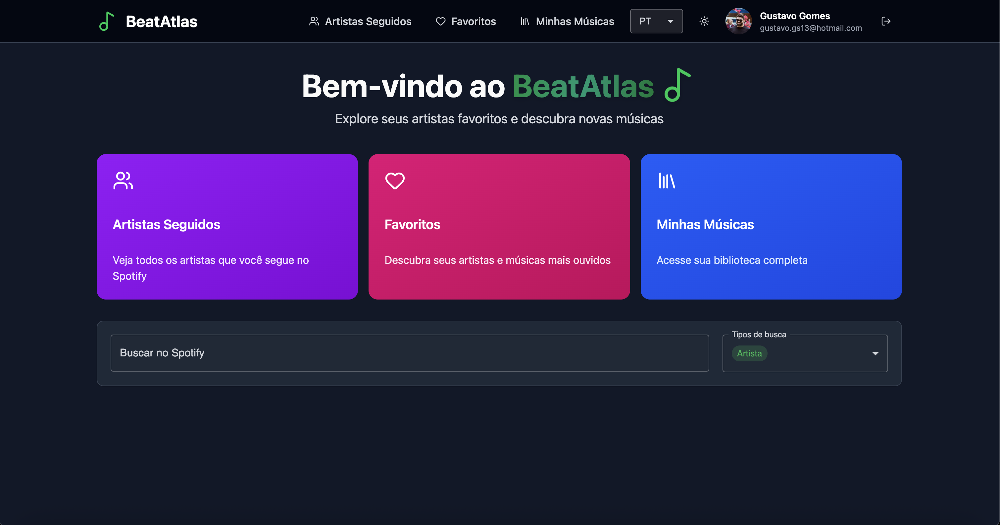

### Artistas Seguidos

**Tema Claro:**
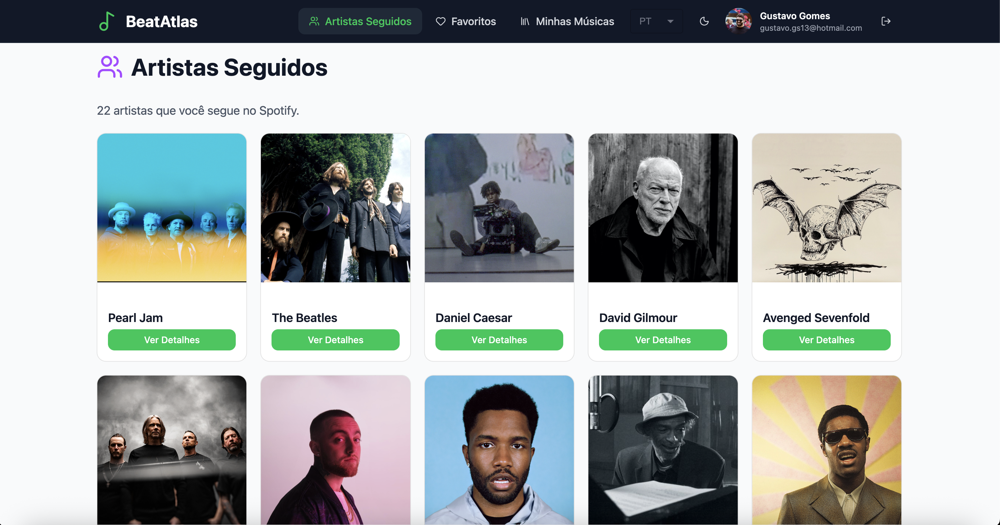

**Tema Escuro:**
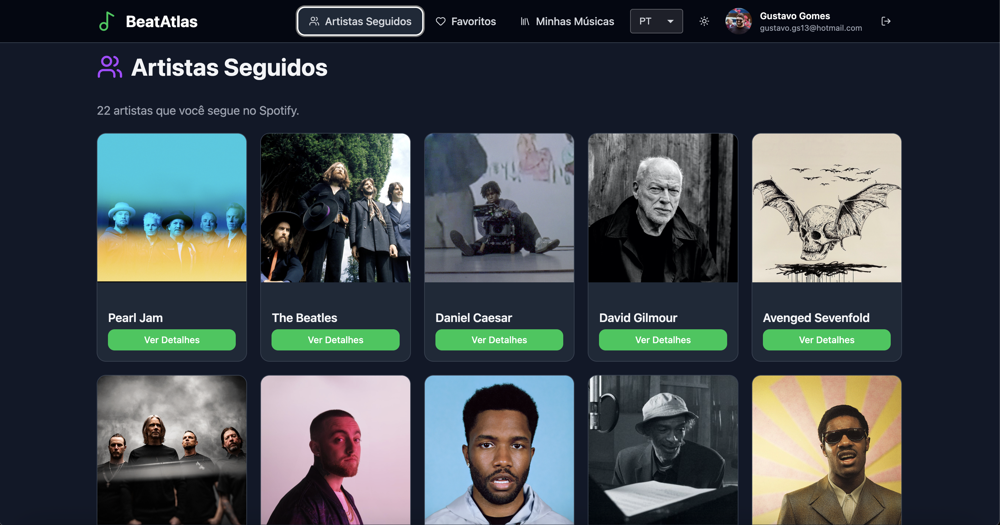

### Favoritos

**Tema Claro:**
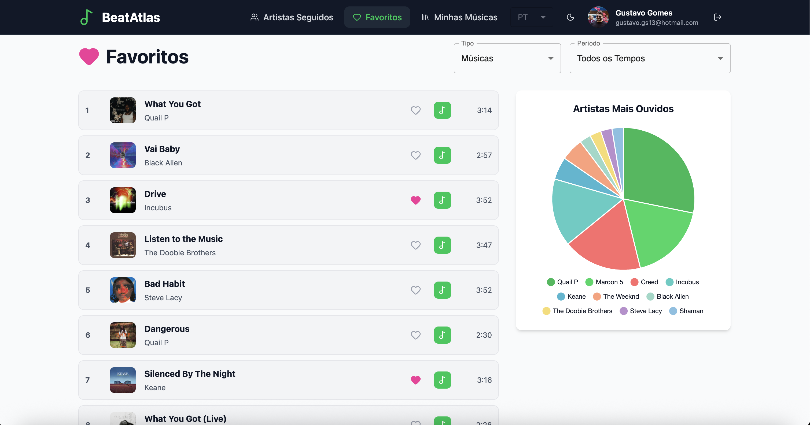

**Tema Escuro:**
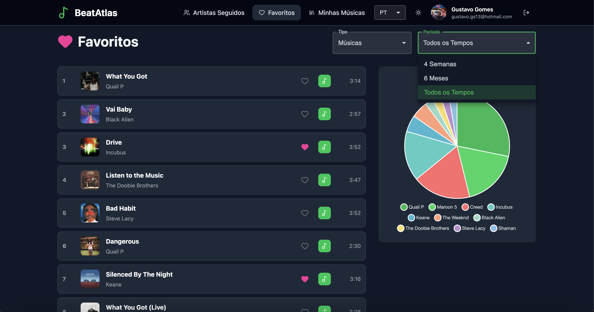

### Detalhes do Artista

**Tema Claro:**
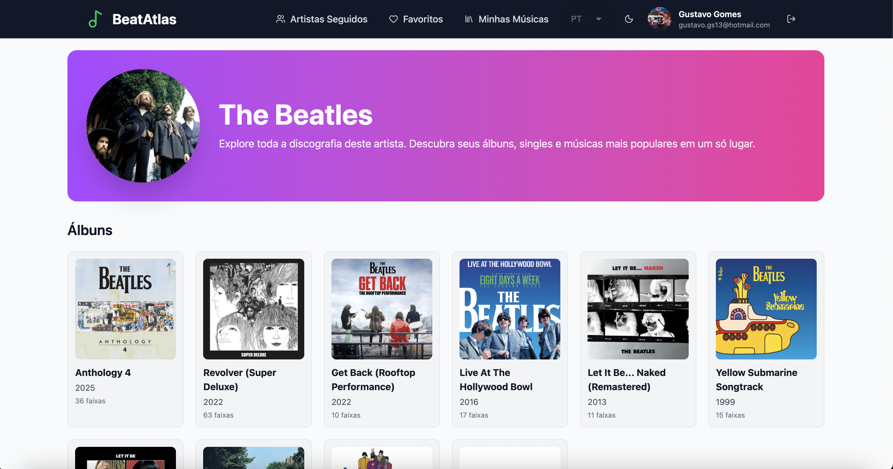

**Tema Escuro:**
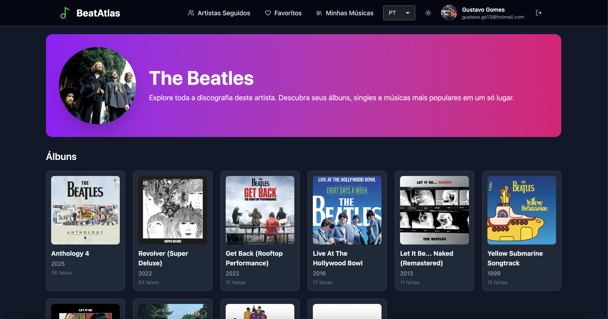

### Minhas Músicas

**Tema Claro:**
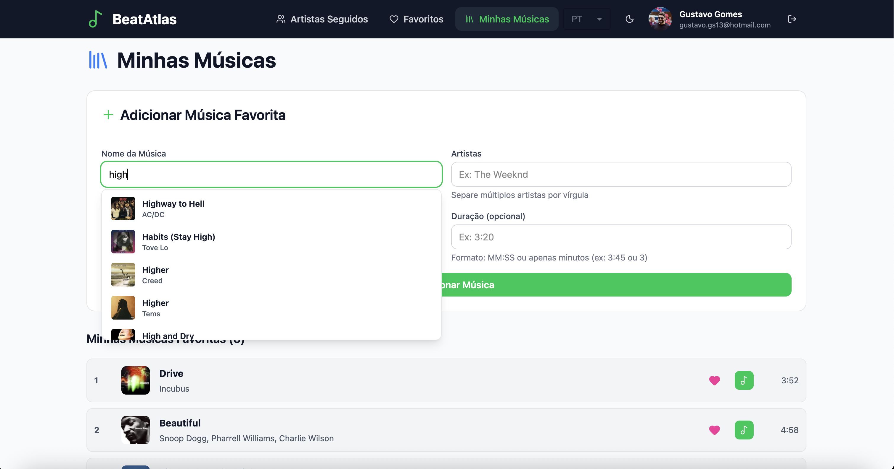

**Tema Escuro:**
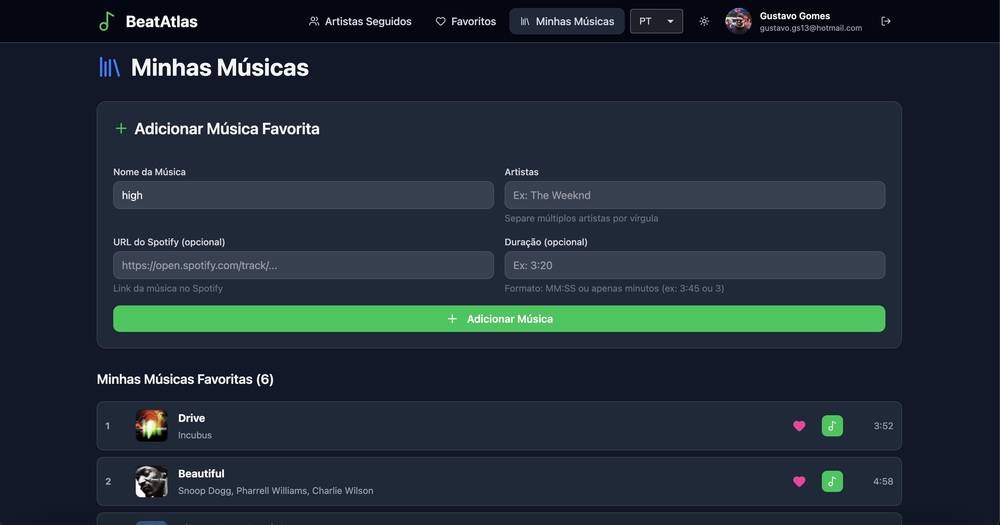

## 📁 Estrutura do Projeto

```
beat-atlas/
├── public/                 # Arquivos estáticos
├── src/
│   ├── components/         # Componentes reutilizáveis
│   │   ├── Button/
│   │   ├── Card/
│   │   ├── CardArtist/
│   │   ├── CardAlbum/
│   │   ├── ChartPie/
│   │   ├── Container/
│   │   ├── Header/
│   │   ├── InputSearch/
│   │   ├── MusicItem/
│   │   └── ...
│   ├── configs/            # Configurações
│   │   ├── configQueryClient/
│   │   └── userHttpClient/
│   ├── contexts/           # Context API
│   │   └── UserContext/
│   ├── hooks/              # Custom hooks
│   │   ├── useSpotifySearch.ts
│   │   ├── useSpotifyFollowedArtists.ts
│   │   ├── useSpotifyTopTracks.ts
│   │   └── ...
│   ├── i18n/               # Internacionalização
│   │   ├── locales/
│   │   │   ├── pt.json
│   │   │   └── en.json
│   │   └── config.ts
│   ├── pages/              # Páginas da aplicação
│   │   ├── Home/
│   │   ├── Login/
│   │   ├── FollowedArtists/
│   │   ├── Favorites/
│   │   ├── DetailsArtist/
│   │   └── MyMusics/
│   ├── routes/              # Configuração de rotas
│   ├── services/            # Serviços (API)
│   │   ├── oauthService.ts
│   │   └── spotifyApi.ts
│   ├── styles/              # Estilos globais
│   │   ├── index.css
│   │   ├── tailwind.css
│   │   └── theme.css
│   ├── types/               # Tipos TypeScript
│   │   └── spotify.ts
│   └── utils/               # Utilitários
│       ├── cn.ts
│       └── formatDuration.ts
├── .env                     # Variáveis de ambiente (não versionado)
├── package.json
├── vite.config.ts
└── README.md
```

## 🎯 Scripts Disponíveis

- `yarn dev` - Inicia o servidor de desenvolvimento
- `yarn build` - Cria a build de produção
- `yarn preview` - Preview da build de produção
- `yarn lint` - Executa o linter

## 🔧 Configuração do Spotify

Para usar esta aplicação, você precisa:

1. Acessar o [Spotify Developer Dashboard](https://developer.spotify.com/dashboard)
2. Criar uma nova aplicação
3. Copiar o **Client ID**
4. Adicionar `http://127.0.0.1:5173/callback` como **Redirect URI** (importante: use `127.0.0.1` ao invés de `localhost`)
5. Adicionar o Client ID no arquivo `.env` como `VITE_CLIENT_ID`

> 💡 **Quer entender melhor como funciona o OAuth 2.0?** Consulte a [documentação completa do OAuth](OAUTH_EXPLAINED.md) que explica em detalhes o fluxo de autenticação, segurança e implementação.

## 🌐 Internacionalização

A aplicação suporta múltiplos idiomas:
- 🇧🇷 Português (padrão)
- 🇺🇸 Inglês

O idioma pode ser alterado através do seletor no header.

## 🎨 Temas

A aplicação suporta dois temas:
- ☀️ Claro (padrão)
- 🌙 Escuro

O tema pode ser alternado através do botão no header.

## 📚 Documentação Adicional

- **[OAuth 2.0 - Guia de Implementação](OAUTH_EXPLAINED.md)**: Documentação completa sobre como o OAuth 2.0 foi implementado neste projeto, incluindo explicações detalhadas sobre o fluxo de autenticação, segurança, refresh tokens e boas práticas.

## 📝 Licença

Este projeto é de código aberto e está disponível sob a licença MIT.

## 👨‍💻 Desenvolvido por Gustavo Gomes

Feito com ❤️ usando React, TypeScript e Tailwind CSS.

---

**Nota:** Este projeto é apenas para fins educacionais e de demonstração. Certifique-se de seguir os [Termos de Serviço da API do Spotify](https://developer.spotify.com/terms) ao usar em produção.
